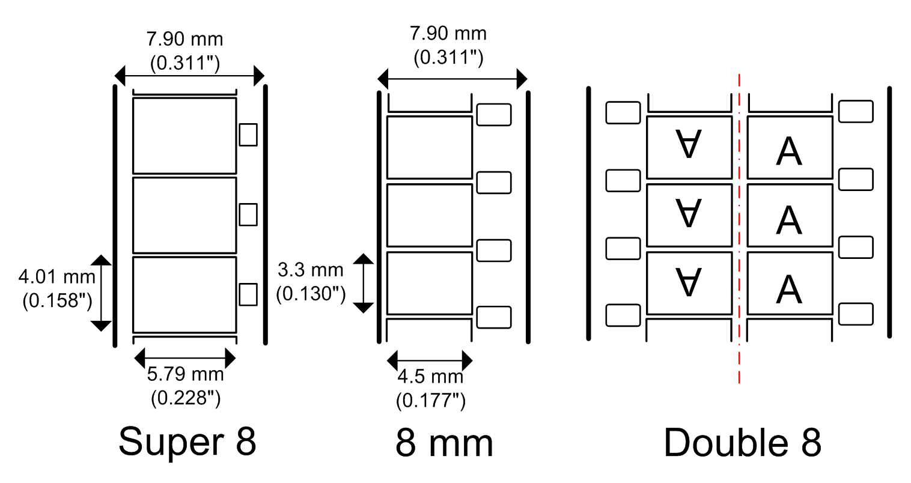
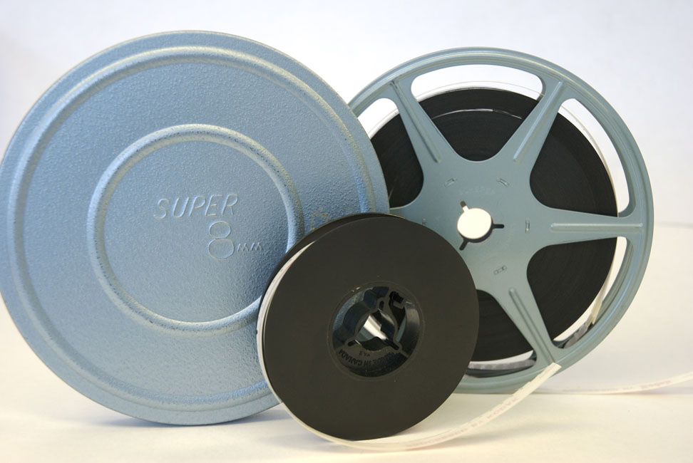
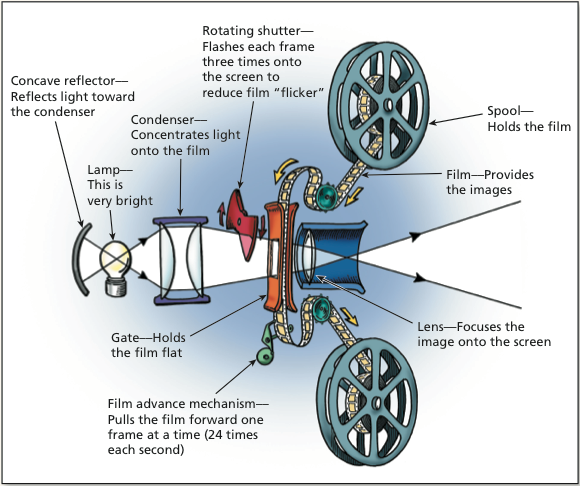
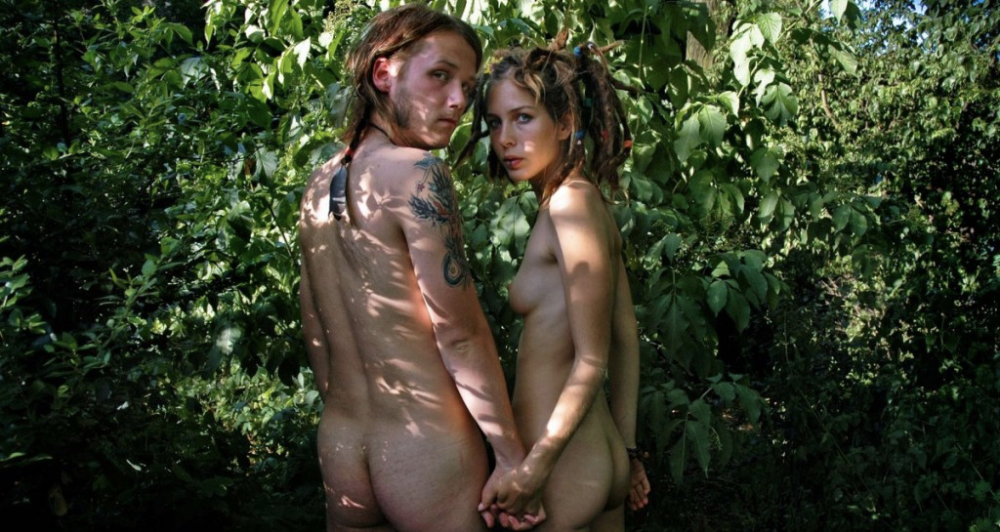
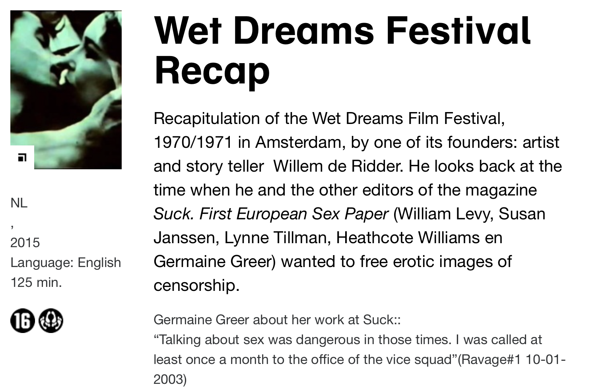
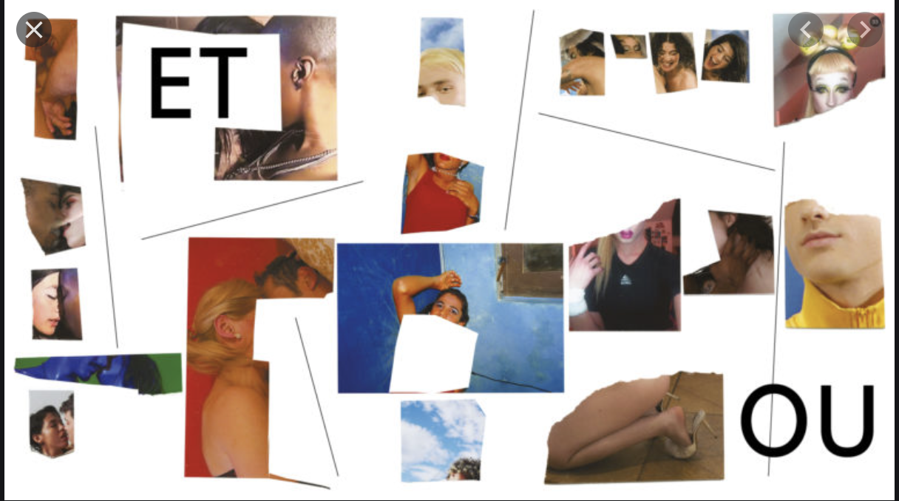
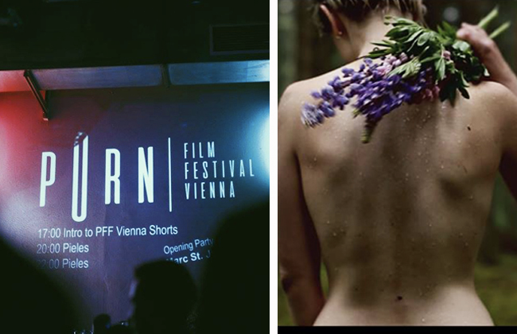

[](#)
# THE VALUE OF PORN: Processing and preserving pornography
> “There is always a bit of testicle at the bottom of our most sublime ideals” - Diderot      


### Table of Contents
1. [Artefact](#Artefact)
    1. [Metadata](#Metadata)
2. [Research](#Research-on-the-Value-of-Pornography)
    1. [Photo and Video processes](#Photo-and-Video-processes)
    2. [Pornography & Art](#Pornography-and-Art)
    3. [Pornography & Activism](Pornography-and-Activism)
    4. [Pornography in the Public sphere](#Pornography-in-the-Public-Sphere)
3. [Transcoding](#Transcoding)
    1. [Transcoding No. 1](#Transcoding-no-1)
    2. [Transcoding Tool](#Transcoding-tool)
4. [Reflection](#Reflection)
5. [Outcome](#Outcome)
6. [Conclusion](#Conclusion)
7. [Bibliography](#Bibliography)

# Artefact
The complete Bill Levy archive: "Suck". Suck was a European pornographic magazine created in the 70s by among others Jim Haynes, William Levy, Heathcote Williams, Germaine Greer, and Jean Shrimpton. The founders of Suck also organised 2 film festivals in Amsterdam titled "The Wet Dream Film Festival (1&2)". 10 of the movies shown during this festival are now stored in the International Institute of Social History in Amsterdam. "Colt und Köcher" is one of them and also the subject of my research.

## Metadata
| Tag | Data |  
|--|--|
**Collection ID** | [ARCH00817](https://search.iisg.amsterdam/Record/ARCH00817#Aa0fc94d859)
| **Physical Description** | Documents on the sexual liberation movement centered around Suck magazine. Besides those pertaining to the eight original numbers of the magazine, also documents for the Suck special issue “The Virgin Sperm Dancer”, both the Wet Dream Film Festivals, and the Wet Dreams Book. Documents include correspondence; financial and organizational documents; articles, drawings and photographs received for publication; plans for lay-out; tapes and transcriptions of interviews; copies of some of the films shown at the Festivals. The collection also contains a collection of (both pornographic and non-pornographic) photographs with more than 1500 images and a smaller collection of unpublished material, including some unfulfilled plans for alternative projects.
| **Selected Object** | Colt und Köcher
| **Medium** | Super 8mm film, 6min
| **Date** | 1970
|| The super 8mm Film and its cover box

# Research on the Value of Pornography
<details>
  <summary>Reading List</summary>

  <details>
    <summary>Archive Fever</summary>
Derrida - http://artsites.ucsc.edu/sdaniel/230/derrida_archivefever.pdf

> Archiving Is a question of the future [...] of a promise and of a responsibility for tomorrow. If we want to know what this will have meant, we will only know in the times to come.

- There is no beginnings, just traces - To understand this, you must first understand that etc...
- The desire to understand moments of inception (the establishment or starting point of an institution or activity)
- Beginnings and origins, which we think might be some kind of truth - but they leaves spaces to which we/historian makes their own mark
- Nothing starts in an archive, everything is halfway through - discontinuity
- Meaning in both commencement and commandment
- Archive and public vs private space. Who has the right to enter? How to classify? Who chooses?
</details>
<details>
  <summary>Beyond Gratification: The benefits of pornography and the  demedicalization of female sexuality </summary>
Jeneanne Orlowski - https://digitalcommons.wcl.american.edu/cgi/viewcontent.cgi?article=1171&context=tma
- An on- going debate among feminists regarding the value of pornography and whether it should be protected under the First Amendment
- Pornography is an important type of speech because it plays a vital role in the communication of ideas.
- pornography can be used as a tool to educate women and empower them
</details>
<details>
  <summary>Sex in The Archive:</summary>
  GVGK Tang - https://americanarchivist.org/doi/pdf/10.17723/0360-9081-80.2.439

  > How will both analog and contemporary born-digital (e.g., Internet-based) pornographies be processed given the stigmas and metadata issues surrounding sexually explicit materials in the archives?

  - Archives are unexpectedly political
  - To process porn, one must consume it and risk internalizing the notion that one is a pervert for doing so
  - Analog erotica brings up questions of copyright infringement and privacy rights
  - Providing context and demonstrating the cultural and historical value of the collections” is key for pornography
  - Sex and archives, by convention, seem like opposites: a private experience versus a public institution
</details>
</details>

## Photo and Video processes
8 mm film is a motion picture film format in which the film strip is eight millimeters wide. It exists in two main versions — the original standard 8 mm film, also known as regular 8 mm, and Super 8. Although both standard 8 mm and Super 8 are 8 mm wide, Super 8 has a larger image area because of its smaller and more widely spaced perforations.
              

The mechanism of the projector at the archive was unfortunately broken. And so it was only possible to watch the movie frame by frame.

## Pornography and Art
### Andrea Frase "Untitled" & Skin, 2009
we speak of consuming pornography and of appreciating art which indicates that there is a fundamental difference in how we are meant to engage with both kinds of representation, but the two approaches are not mutually exclusive. [1]

   

Andrea Fraser, Untitled (2003): The artist is seen having sex with an unidentified American collector. <br/>
Skin, 2009: Two figures in nude bodysuits start making out, cutting away parts of their costumes as they grow more aroused. “Art meets Porn” -shown in Museum

```
How can we define the line between art & pornography?
Can the label of "art" add value to pornography?
Can the label of "art" help transgress the private space and bring pornography into the public sphere?
```

## Pornography and Activism
Pleasure and freedom as a form of protest against dominant power structures.
The digital age has banalised sexuality and therefore affected our representations. We are both the witnesses and the actors of a moving culture where sexuality evolves too, increasingly leading to hypersexualised societies where sexual contents are at our fingertips. Sex is marketable and sexual content usually only reinforce the status quo. [2] <br/>

### Fuck For Forest
 <br/>
>"Porn makes really, really a lot of money, so why not use that money for good?"

Fuck for Forest (FFF) is a non-profit environmental organisation founded in 2004 in Norway by Leona Johansson and Tommy Hol Ellingsen. It funds itself through a website of sexually explicit videos and photographs, charging a membership fee for access. They believe in saving the planet by videotaping themselves having sex. The concept here is that the group sells homemade porn on the internet, using the funds to buy up threatened rainforest land.It is the world's first eco-porn organisation and may be the only porn website specifically created to raise money for a cause.

```
How can Pornography be used as a tool for Activism?
Can Activism give new relevance to porn?
How can Pornography be used as a story telling device?
```

## Pornography in the Public Sphere

### Eye Museum
 <br/>
An Event that took place in 2015 at the eye museum in Amsterdam. It was a recapitulation of the Wet Dreams Film Festival, 1970/1971 in Amsterdam, by one of its founders: artist and story teller Willem de Ridder.

### La Fête du Slip
 <br/>
La Fête du Slip is an annual alternative-porn film festival held in Lausanne, Switzerland. It is Romandy's first and biggest multidisciplinary festival whose sole purpose is to focus on body, gender, and sexuality in art.

### Porn Film Festival Vienna
 <br/>
A showcase and celebrate of the colourful diversity of porn. The goal of this festival is to stimulate an open, societal debate. Its mission is to bring a genre back into the public sphere of the cinema that is usually locked away in private quarters. Its prime directive is to present the creativity and political possibilities of a defining (yet always hidden) part of society. The goal is to challenge prejudices and stereotypes. The festival offers a film and theory program that breaks the monotony boring cheesy mainstream porn – to proudly presents feminist, queer & LGBTIQ* positions. The Porn Film Festival Vienna wants to create an open and welcoming space for reception, discussion, and reflection and to challenge and broaden horizons. Because porn can be: lustful, honest, friendly and self-determined!

# Transcoding
By creating different systems of transcoding, I'm hoping that each way of transcoding will question the value of the pornographic film presented either by adding or deducting value. I want to question our relation to porn and navigate between the line of the private and the public sphere.

## Transcoding No. 1
### Description
Short description here. You can structure the information and documentation for each transcoding, design research or coding tool as you like. It's important that you make clear the aims & goals of the transcoding, what methods and tools you use. If this is often the same across different transcodings, consider making a standardised table at the beginning of each.

You should include well-formatted documentation of your experiments and developments below. Someone without previous knowledge about your work should be able to follow along the steps, aims and results of your developments from this structure. Make sure all media used is correctly linked or embedded (images, PDFs, Videos, etc).

### Methods
Description of your methods, documentation of behind-the-scenes processes can go here. Think of the photos and videos you made when visiting the IISG or during captures of your artefact. You can use tools such as [Gifs.com](https://gifs.com/) to generate moving-image thumbnail to link to short videos.Just enough to give a clear overview, before getting into details.  

With some HTML tags you can do simple styling in markdown, for example:

    <width="50%">
[](https://youtu.be/o2rmmqxC4NU)

Remember to include the url link to jump to the full media, of course!
