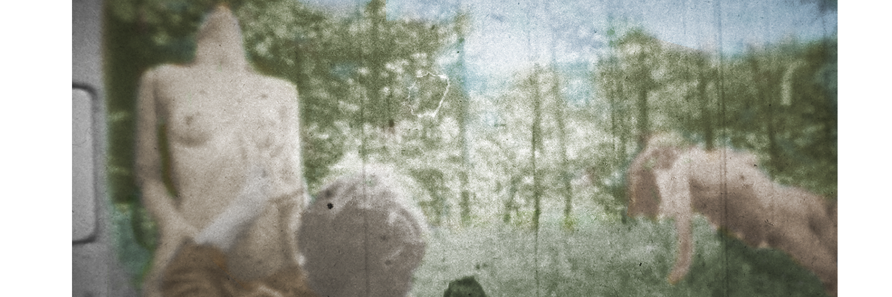

# THE VALUE OF PORN: Processing and preserving pornography
> “There is always a bit of testicle at the bottom of our most sublime ideals” - Diderot      

### Table of Contents
1. [Artefact](#Artefact)
    1. [Metadata](#Metadata)
2. [Research](#Research-h1)
3. [Transcoding](#Transcoding)
    1. [Transcoding No. 1](#Transcoding-no-1)
    2. [Transcoding Tool](#Transcoding-tool)
4. [Reflection](#Reflection)
5. [Outcome](#Outcome)
6. [Conclusion](#Conclusion)
7. [Bibliography](#Bibliography)

# Artefact
The complete Bill Levy archive: "Suck". Suck was a European pornographic magazine created in the 70s by among others Jim Haynes, William Levy, Heathcote Williams, Germaine Greer, and Jean Shrimpton. The founders of Suck also organised 2 film festivals in Amsterdam titled "The Wet Dream Film Festival (1&2)". 10 of the movies shown during this festival are now stored in the International Institute of Social History in Amsterdam. "Colt und Köcher" is one of them and also the subject of my research.

## Metadata
| Tag | Data |  
|--|--|
**Collection ID** | [ARCH00817](https://search.iisg.amsterdam/Record/ARCH00817#Aa0fc94d859)
| **Physical Description** | Documents on the sexual liberation movement centered around Suck magazine. Besides those pertaining to the eight original numbers of the magazine, also documents for the Suck special issue “The Virgin Sperm Dancer”, both the Wet Dream Film Festivals, and the Wet Dreams Book. Documents include correspondence; financial and organizational documents; articles, drawings and photographs received for publication; plans for lay-out; tapes and transcriptions of interviews; copies of some of the films shown at the Festivals. The collection also contains a collection of (both pornographic and non-pornographic) photographs with more than 1500 images and a smaller collection of unpublished material, including some unfulfilled plans for alternative projects.
| **Selected Object** | Colt und Köcher
| **Medium** | Super 8mm film, 6min
| **Date** | 1970
|| The super 8mm Film and its cover box

# Research on the Value of Pornography
is it about adding value or reclaiming its initial value?

  
Reading List

  

    
Archive Fever

Derrida - http://artsites.ucsc.edu/sdaniel/230/derrida_archivefever.pdf

> Archiving Is a question of the future [...] of a promise and of a responsibility for tomorrow. If we want to know what this will have meant, we will only know in the times to come.

- There is no beginnings, just traces - To understand this, you must first understand that etc...
- The desire to understand moments of inception (the establishment or starting point of an institution or activity)
- Beginnings and origins, which we think might be some kind of truth - but they leaves spaces to which we/historian makes their own mark
- Nothing starts in an archive, everything is halfway through - discontinuity
- Meaning in both commencement and commandment
- Archive and public vs private space. Who has the right to enter? How to classify? Who chooses?

  
Beyond Gratification: The benefits of pornography and the  demedicalization of female sexuality 

Jeneanne Orlowski - https://digitalcommons.wcl.american.edu/cgi/viewcontent.cgi?article=1171&context=tma
- An on- going debate among feminists regarding the value of pornography and whether it should be protected under the First Amendment
- Pornography is an important type of speech because it plays a vital role in the communication of ideas.
- pornography can be used as a tool to educate women and empower them

  
Sex in The Archive:

  GVGK Tang - https://americanarchivist.org/doi/pdf/10.17723/0360-9081-80.2.439

  > How will both analog and contemporary born-digital (e.g., Internet-based) pornographies be processed given the stigmas and metadata issues surrounding sexually explicit materials in the archives?

  - Archives are unexpectedly political
  - To process porn, one must consume it and risk internalizing the notion that one is a pervert for doing so
  - Analog erotica brings up questions of copyright infringement and privacy rights
  - Providing context and demonstrating the cultural and historical value of the collections” is key for pornography
  - Sex and archives, by convention, seem like opposites: a private experience versus a public institution

## Pornography & Art
we speak of consuming pornography and of appreciating art which indicates that there is a fundamental difference in how we are meant to engage with both kinds of representation, but the two approaches are not mutually exclusive.

   

Andrea Fraser, Untitled (2003): The artist is seen having sex with an unidentified American collector.  
Skin, 2009: Two figures in nude bodysuits start making out, cutting away parts of their costumes as they grow more aroused. “Art meets Porn” -shown in Museum
